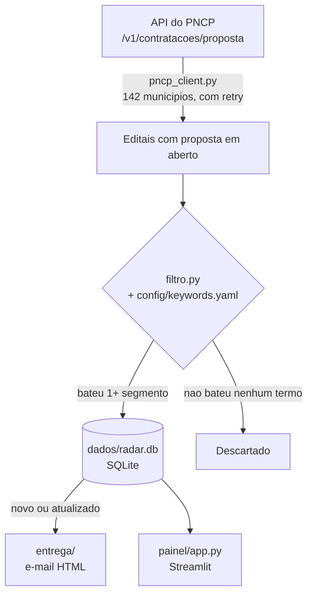

# Radar NexLicit

[](https://github.com/brunogitti/radar-nexlicit/actions/workflows/captura-diaria.yml)
[](https://www.python.org/)
[](LICENSE)
[](https://radarnexlicit.streamlit.app)

Captura editais com proposta em aberto no Portal Nacional de Contratações Públicas (PNCP) para uma lista fixa de 142 municípios de SP, MG e MS, filtra por palavra-chave configurável, etiqueta cada edital com o segmento de produto correspondente (Limpeza, EPI, Informática, Tinta e Pintura, entre outros), deduplica contra execuções anteriores e entrega por e-mail. Roda sozinho duas vezes ao dia via GitHub Actions e alimenta um [painel público em Streamlit](https://radarnexlicit.streamlit.app).

Projeto com dois propósitos: uso operacional real pela [NexLicit](https://github.com/brunogitti) (consultoria em licitações) e peça de portfólio pública.

## Por que existe

O PNCP centraliza a publicação de editais de compra pública de todo o Brasil, mas cada órgão publica o próprio, sem nenhuma visão agregada por município ou por tipo de produto. Uma consultoria de licitações que presta serviço pra fornecedores de nichos específicos (material de limpeza, EPI, tinta, informática, etc) precisaria entrar prefeitura por prefeitura, todo dia, pra não perder um prazo de proposta. Isso não escala manualmente.

O Radar automatiza essa vigilância: busca, filtra pelos segmentos de interesse, remove o que já foi visto antes e avisa por e-mail o que é novo ou mudou (prazo, valor, situação). O painel público existe pra qualquer pessoa acompanhar o resultado sem precisar rodar nada localmente.

## Como funciona



| Módulo | Responsabilidade |
| --- | --- |
| `captura/pncp_client.py` | Fala com a API do PNCP: monta a requisição, pagina resultado, decide quando vale a pena tentar de novo num erro de rede. |
| `captura/filtro.py` | Lê o `config/keywords.yaml` e decide quais segmentos batem no texto de cada edital. |
| `captura/normalizacao.py` | Normaliza texto (sem acento, minúsculo) e decide se um termo bate, por radical de palavra ou frase exata. |
| `captura/modelos.py` | Formato padrão (`Edital`) usado por todos os outros módulos. |
| `captura/banco.py` | Persiste em SQLite e decide se um edital é novo, atualizado ou sem mudança desde a última execução. |
| `captura/apresentacao.py` | Formata dado de edital pra texto legível, reaproveitado no terminal e no e-mail. |
| `entrega/resumo.py` | Monta o HTML do e-mail a partir dos editais classificados. |
| `entrega/email_sender.py` | Envia o e-mail via SMTP do Gmail. |
| `painel/app.py` | Painel público Streamlit; só lê o banco já salvo, não bate na API do PNCP. |
| `main.py` | Orquestra tudo: captura, filtro, banco, entrega. |

### Persistência sem banco externo

O runner do GitHub Actions é efêmero, perde tudo ao final de cada execução. Em vez de contratar um banco de dados externo só pra guardar o `dados/radar.db` entre uma captura e outra, o projeto usa uma branch git dedicada, `data`, como persistência: cada execução do workflow restaura o banco salvo na última vez, roda a captura por cima, e sobrescreve essa branch com o banco atualizado (um commit só, `--force`, sem acumular histórico). É essa branch, não a `master`, que o Streamlit Community Cloud lê pra alimentar o painel público, então uma mudança de código só aparece lá depois que o workflow rodar de novo.

### Segmentação por palavra-chave configurável

`config/keywords.yaml` define os segmentos de produto sem precisar tocar em código Python. Cada regra pode exigir um termo sozinho ou uma combinação de termos (lógica E, pra evitar termo genérico demais sozinho), e pode excluir um termo específico pra cortar falso positivo já observado. Todo termo novo é calibrado contra editais reais (`python main.py --testar-termo "..."`) antes de entrar em produção, nunca cravado só por parecer óbvio.

### Documentos buscados ao vivo, nunca salvos

Itens do edital ficam salvos (tabela `itens_edital`), mas os documentos/anexos não: a busca é sempre feita ao vivo na API do PNCP no momento em que o card é aberto no painel, decisão deliberada pra não criar um schema novo só por causa de um link de download.

## Rodando localmente

```
git clone https://github.com/brunogitti/radar-nexlicit.git
cd radar-nexlicit
python -m venv venv
venv\Scripts\activate                                   # Windows
pip install -r requirements.txt
copy .env.example .env                                  # preencher credenciais de e-mail

python main.py --dias 30                                # captura, sem enviar e-mail
python main.py --dias 30 --enviar-email seu@email.com   # captura + envia e-mail
python main.py --historico --dias 90                    # so consulta o banco local
streamlit run painel/app.py --server.port 8501           # painel local
```

## Testes

```
python -m pytest tests/ -v
```

64 testes, suíte inteira roda em menos de 1 segundo. Todo módulo de `captura/` e `entrega/` tem um arquivo de teste correspondente; chamada externa (HTTP, SMTP) é sempre trocada por mock, nunca bate em serviço de verdade dentro de um teste automatizado.

## Configuração

- **`config/keywords.yaml`**: 19 segmentos de produto (Limpeza, Expediente, Copa e cozinha, Gêneros alimentícios, Descartáveis, Informática, Eletrônicos, Elétrica, Hidráulica, Construção, Tinta e Pintura, Gráfico, Uniformes e vestuário, EPI, Móveis, Automotivo, Pilha e Bateria, Piscina, Decoração), mais uma lista de exclusões globais.
- **`config/municipios.csv`**: 142 municípios monitorados (130 SP, 9 MG, 3 MS), cada um com código IBGE e uma coluna `ativo` pra ligar/desligar um município sem editar código.
- **`.env`**: credenciais de e-mail (Gmail) usadas por `entrega/email_sender.py`. Ver `.env.example` pro formato esperado.

## Automação (GitHub Actions)

`.github/workflows/captura-diaria.yml` roda todo dia às 7h e às 13h (horário de Brasília), ou manualmente via `gh workflow run captura-diaria.yml`. Cada execução: restaura o banco salvo na branch `data`, roda a suíte de testes automatizados (só segue adiante se passar), captura e filtra os editais dos 142 municípios, envia o e-mail com o que é novo, e publica o banco atualizado de volta na branch `data`.

## Stack

Python 3.12+, [requests](https://requests.readthedocs.io/) (chamada HTTP à API do PNCP), [PyYAML](https://pyyaml.org/) (leitura do `keywords.yaml`), SQLite (biblioteca padrão do Python, sem servidor externo), [Streamlit](https://streamlit.io/) (painel público), [pytest](https://docs.pytest.org/) (testes), GitHub Actions (automação e persistência via branch `data`).

## Limitações conhecidas

- Os endpoints de itens e de arquivos do PNCP usados aqui não estão documentados no Swagger oficial da API; o comportamento foi confirmado testando contra o serviço real, não contra documentação.
- O PNCP tem instabilidade conhecida (erros 429/500/timeout); o cliente tenta de novo automaticamente, mas um município pode ainda assim ficar de fora de uma execução pontual (fica registrado no log e num resumo ao final da captura).
- Documentos do edital não ficam salvos em lugar nenhum: se a API do PNCP estiver fora do ar no momento em que o card é aberto no painel, o link de download simplesmente não aparece naquela visita.

## Licença

[MIT](LICENSE).
